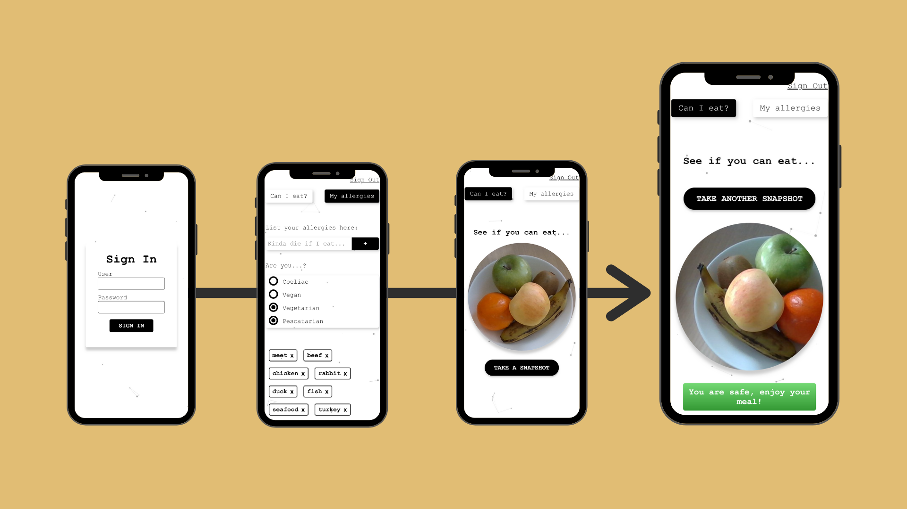

## Description

`Can I Eat` is a project dedicated to help you stay safe while exploring 🌍 new food. After creating your account you can simply select your list of allergies 🥜, take a photo of your meal, send it to the amazing [Clarifai](https://www.clarifai.com/) AI 🤖, and within seconds receive the probabilites of any allergy traces in your dish ⚠️.

On the developer side, the app has been fully tested with unit and integration testing, with the use of Jasmine and Karma as well as backend testing with Jest and Supertest, providing a robust development of the app.

## Getting-Started

Please follows this steps if you would like to start the project:

1) Clone the repo.
2) Register to [Clarifai](https://www.clarifai.com/) to get your API KEY.
3) Create a Postgres DB named ```allergy_checker```.
2) ```cd client && npm install```
3) Run ```ng serve``` from the client repository.
4) ```cd server && npm install```
5) In the server repository create a ```config.js``` file with these variables:
```
module.exports = {
  FOOD_MODEL_ID: "<FOOD_MODEL_ID",
  API_KEY: "<API KEY>",
  DB_USERNAME: "<DB_NAME>",
  DB_PASSWORD: "<PASSWORD>",
  DB_TEST_NAME: "<DB_TEST_NAME>"
}
```
6) Run ```npm start``` from the serve repository.

You just have now to take photos, enjoy ! 🍕

## Screenshots

### Mobile Version 

<div align="center">
  
</div>

### Desktop Version 

<div align="center">
  
</div>

 ## Tech Stack
* [Angular](https://angular.io/)
* [Postgres](https://www.postgresql.org/)
* [Sequelize](https://sequelize.org/)
* [Node.JS](https://nodejs.org/en/)
* [Express](https://expressjs.com/)
* [Jasmine](https://jasmine.github.io/pages/getting_started.html)
* [Karma](https://karma-runner.github.io/latest/index.html)
* [Jest](https://jestjs.io/)
* [supertest](https://www.npmjs.com/package/supertest)

## Developers

- Ewa Rasala - [Github](https://github.com/ewaras) - [LinkedIn](https://www.linkedin.com/in/ewa-rasala)
- Charles-Thibault Verrier - [Github](https://github.com/chthve) - [LinkedIn](https://www.linkedin.com/in/chthve/)
- Marcel Subirana - [Github](https://github.com/marcel2408) - [LinkedIn](https://www.linkedin.com/in/marcel-subirana-campanera/)
