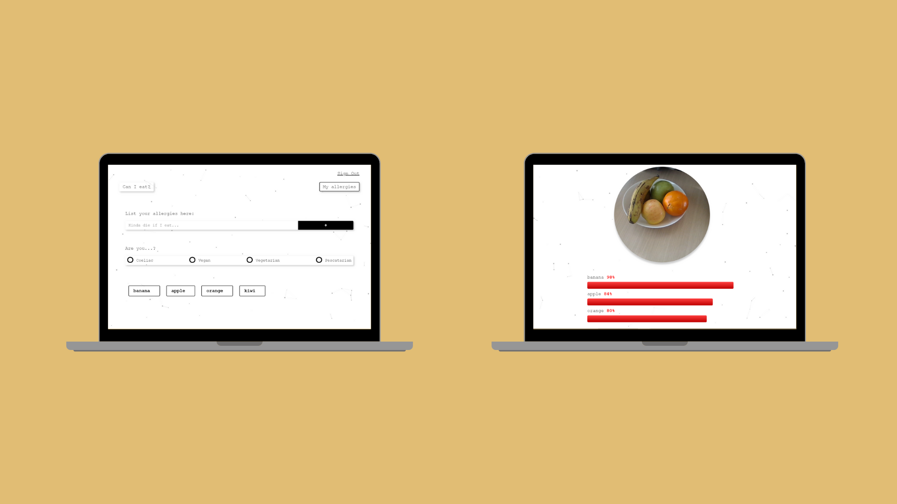

# Can I Eat?

Do you have food allergies or simply ingredients that you just don't like?

Use Can I Eat and be aware of the probability of any meal to contain these items that you really want to avoid.

It is as simple as listing the food items and take a picture of your food, and Can I Eat will tell you if you are safe.

Enjoy your meal!

## Screenshots

### Desktop

<div align="center">
  
</div>


### Mobile

<div align="center">
  
</div>


## Getting started

Since this project uses PostgreSQL as database, you will need to set up a new database and name it.

Furthermore, for the image recognition this app works with [Clarifai Food Model API](https://www.clarifai.com/models/food), and you will need to setup a free account to obtain the ID and API KEY. 

Clone the repo:

```bash
$ git clone https://github.com/Marcel2408/can-i-eat.git
$ cd can-i-eat
```

Install dependencies:

```bash
$ cd client
$ npm install
$ cd ../server
$ npm install
```
Create a ```.env``` in the root level of this repo.

Fill the file with the following info:
```
FOOD_MODEL_ID=<your Clarifai ID>
API_KEY=<your Clarifai API key>
DB_USERNAME=<your PostgreSQL username>
DB_PASSWORD=<your PostgreSQL password>
DB_TEST_NAME=test_allergies
DB_NAME=<your DB name>
```

## Running the app

Start the client:

```bash
$ cd client
```

```bash
$ npm start
```

The client will run on localhost:4200

Start the server:

```bash
$ cd server
```

```bash
$ npm start
```

The server will run on localhost:3000


The project consists of implementing a full testing suite of the full-stack allergy-checker app, that allows you to quickly take a picture of some food and see if it contains any of your allergies.

Implementation of Angular unit and integration testing, with the use of Jasmine and Karma as well as backend testing with Jest and Supertest.

## Developers

- Ewa Rasala - [Github](https://github.com/ewaras) - [LinkedIn](https://www.linkedin.com/in/ewa-rasala)
- Charles-Thibault Verrier - [Github](https://github.com/chthve) - [LinkedIn](https://www.linkedin.com/in/chthve/)
- Marcel Subirana - [Github](https://github.com/marcel2408) - [LinkedIn](https://www.linkedin.com/in/marcel-subirana-campanera/)